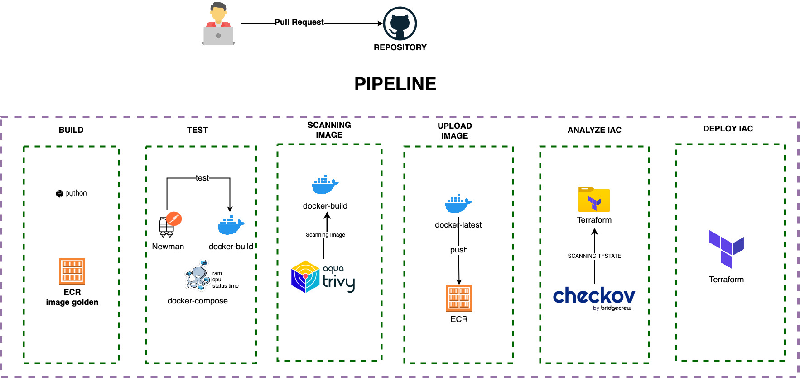

<!-- BEGINNING OF PRE-COMMIT-TERRAFORM DOCS HOOK -->
## Pipeline


## Requirements

Supported Operating System **Linux & MacOs**

| Name | Version |
|------|---------|
| kubectl | >= v1.24.0 |
| aws-cli | >= 2.7.0 |
| jq | >= 1.6 |
| terraform | >= v0.15.0 |
| Makefile | >= 3.81 |
| docker | >= 20.10.8 |
| docker-compose | >= 1.29.2 |
| (*) gsed | >= 4.8 |

(*)MacOs 

## QuickInstall

Quick-Install Wizard is provided that will guide you through the first installation and setup, **environment variables to configure the AWS CLI** https://docs.aws.amazon.com/cli/latest/userguide/cli-configure-envvars.html

```Makefile
make quickstart
```
When you're done, replace /etc/hosts with the balancer's IP addresses to domain.


## Update Image and APP code

Update the application code

```Makefile
make container_update
```

## Generate JWT

{{DOMAIN}}=devops.nttdata.com
```shell
curl --location --request POST 'http://{{DOMAIN}}/generator'
```

## Validate

{{DOMAIN}}=devops.nttdata.com
```shell
curl --location --request POST 'http://{{DOMAIN}}/DevOps' \
--header 'X-Parse-REST-API-Key: 2f5ae96c-b558-4c7b-a590-a501ae1c3f6c' \
--header 'X-JWT-KWY: {{JWT}}' \
--header 'Content-Type: application/json' \
--data-raw '{
"message" : "This is a test",
"to": "Juan Perez",
"from": "Rita Asturia",
"timeToLifeSec" : 45
}'
```

## Troubleshooting

```shell
deprecated API version client.authentication.k8s.io/v1alpha1
```

Fix Linux:
```
curl "https://awscli.amazonaws.com/awscli-exe-linux-x86_64.zip" -o "awscliv2.zip" && unzip awscliv2.zip && sudo ./aws/install
```

Fix MacOS:
```
curl "https://awscli.amazonaws.com/AWSCLIV2.pkg" -o "AWSCLIV2.pkg"
sudo installer -pkg AWSCLIV2.pkg -target /
```